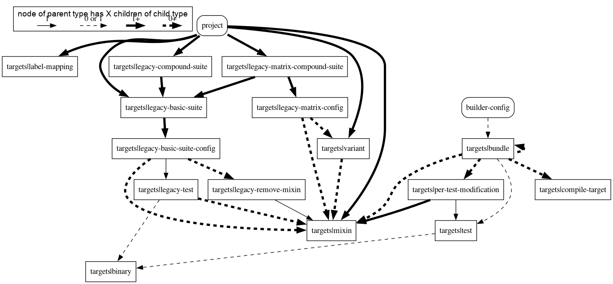
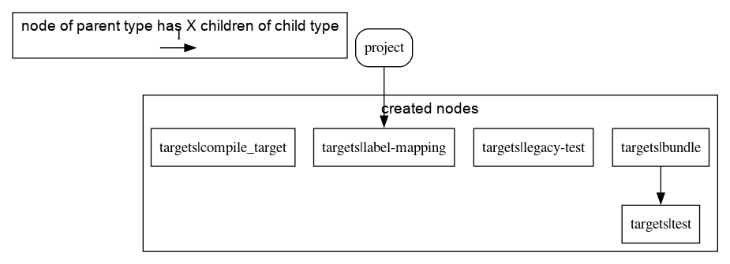
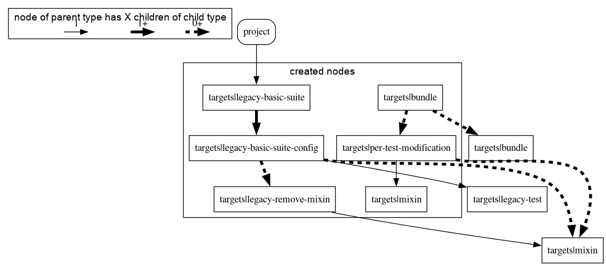
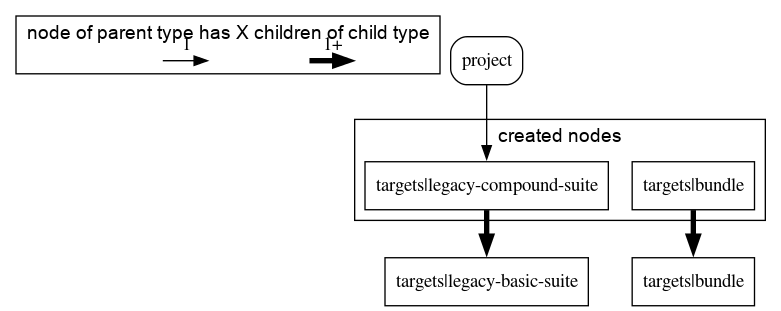
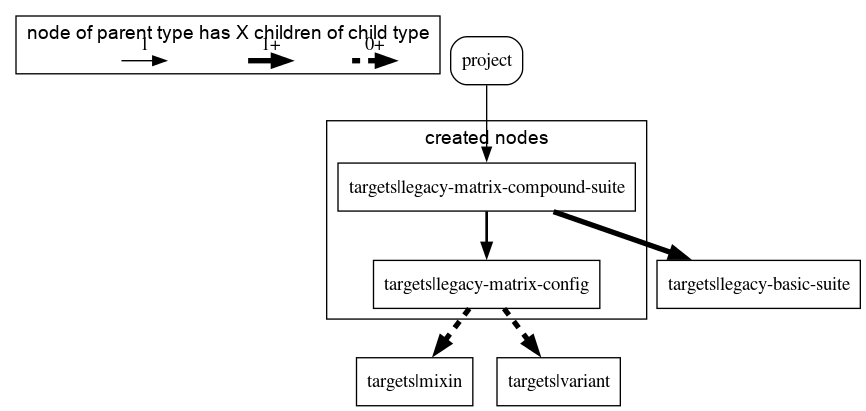
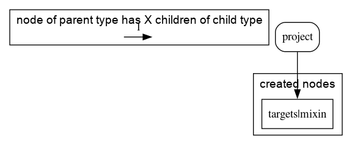
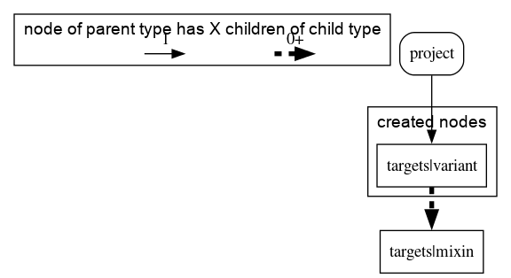
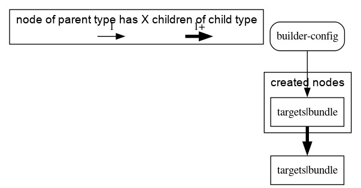
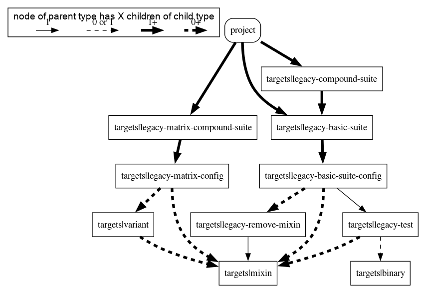

# Targets lib internals

[TOC]

## Node type information

### targets|binary

A target that can be built to run a test

Variable reference: `_targets_nodes.BINARY`

Created by

* functions in `targets.binaries`

Parents

* [targets|legacy-test](#targets_legacy_test) (>=0)
  * created by `targets.test.gtest_test` and `targets.tests.isolated_script_test`
  * traversed when generating details in test_suites.pyl for a test in a basic suite that references a binary
* [targets|test](#targets_test) (<=0)
  * created by targets.tests.gtest_test
  * traversed when generating targets spec files for builders that have their targets defined in starlark

### targets|label-mapping

A mapping from the ninja target name to GN label and associated details.

Variable reference: `_targets_nodes.LABEL_MAPPING`

Created by

* functions in `targets.binaries`
* `targets.tests.junit_test`
  * a mapping with type `"generated_script"` and the same name as the test is created
* targets.compile_target
  * a mapping is created if `name` != `"all"`

Parents

* [project](#project) (1)
  * created for all mappings
  * traversed to generate entries in gn_isolate_map.pyl

### targets|mixin

A set of modifications to make when expanding tests in a suite

Variable reference: `_targets_nodes.MIXIN`

Created by

* `targets.mixin`
  * unnamed instances can be created inline to apply changes to a bundle or to be used for per-test modifications

Parents

* [project](#project) (1)
  * created for all named mixins
  * traversed to generate entries in mixins.pyl
* [targets|legacy-test](#targets_legacy_test) (>=0)
  * created when a test specifies a mixin in `mixins`
  * traversed to generate the `mixins` field for a test when generating a basic suite in test_suites.pyl
* [targets|legacy-basic-suite-config](#targets_legacy_basic_suite_config) (>=0)
  * created when the config for a test in a basic suite references a mixin
  * traversed to generate the `mixins` field for a test when generating a basic suite in test_suites.pyl
* [targets|legacy-matrix-config](#targets_legacy_matrix_config) (>=0)
  * created when the matrix config for a basic suite in a matrix compound suite references a mixin
  * traversed to generate the `mixins` field in test_suites.pyl for the config for a basic suite in a matrix compound suite
* [targets|legacy-remove-mixin](#targets_legacy_remove_mixin) (>=0)
  * created when a test specifies a mixin in `remove_mixins`
  * traversed to generate the `remove_mixins` field for a test when generating a basic suite in test_suites.pyl
* [targets|bundle](#targets_bundle) (>=0)
  * created when a bundle references a mixin
  * traversed when generating targets spec files for builders that have their targets defined in starlark
* [targets|per-test-modification](#targets_per_test_modification) (>=0)
  * created when a per test modification references a mixin
  * traversed when generating targets spec files for builders that have their targets defined in starlark

### targets|variant

A set of modifications to make when multiply expanding a test in a matrix compound suite

Variable reference: `_targets_nodes.VARIANT`

Created by

* `targets.variant`

Parents

* [project](#project) (1)
  * created for all binaries
  * traversed to generate entries in variants.pyl
* [targets|legacy-matrix-config](#targets_legacy_matrix_config) (>=0)
  * created when the matrix config for a basic suite in a matrix compound suite references a variant
  * traversed to generate the `variants` field in test_suites.pyl for the config for a basic suite in a matrix compound suite

### targets|legacy-test

A test that can be included in a basic suite

Variable reference: `_targets_nodes.LEGACY_TEST`

Created by

* functions in `targets.tests`

Children

* [targets|binary](#targets_binary) (0 or 1)
  * created by `targets.test.gtest_test` and `targets.tests.isolated_script_test`
  * traversed when generating details in test_suites.pyl for a test in a basic suite that references a binary
* [targets|mixin](#Node-type-information-targets_mixin) (>=0)
  * created when a test specifies a mixin in `mixins`
  * traversed to generate the `mixins` field for a test when generating a basic suite in test_suites.pyl

Parents

* [targets|legacy-basic-suite-config](#targets_legacy_basic_suite_config) (>=0)
  * created when a basic suite references a test
  * traversed to generate the details for a test when generating a basic suite
    in test_suites.pyl

### targets|legacy-basic-suite

A basic suite, which is a set of tests with optional modifications

Variable reference: `_targets_nodes.LEGACY_BASIC_SUITE`

Created by

* `targets.legacy_basic_suite`

Children

* [targets|legacy-basic-suite-config](#targets_legacy_basic_suite_config) (>0)
  * created when a basic suite references a test
  * traversed to generate the details for a test when generating a basic suite in test_suites.pyl

Parents

* [project](#project) (1)
  * created for all basic suites
  * traversed to generate the `basic_suites` entries in test_suites.pyl
* [targets|legacy-compound-suite](#Node-type-information-targets_legacy_compound_suite) (>=0)
  * created when a compound suite includes a basic suite
  * traversed to generate the basic suite reference when generating a compound
    suite in test_suites.pyl
* [targets|legacy-matrix-compound-suite](#Node-type-information-targets_legacy_matrix_compound_suite) (>=0)
  * created when a matrix compound suite includes a basic suite
  * not traversed, created only to ensure the basic suite exists

### targets|legacy-basic-suite-config

Modifications to apply to a test included in a basic suite

Variable reference: `_targets_nodes.LEGACY_BASIC_SUITE_CONFIG`

Created by

* `targets.legacy_basic_suite`

Children

* [targets|legacy-test](#targets_legacy_test) (1)
  * created when a basic suite references a test
  * traversed to generate the details for a test when generating a basic suite in test_suites.pyl
* [targets|mixin](#Node-type-information-targets_mixin) (>=0)
  * created when the config for a test in a basic suite references a mixin
  * traversed to generate the `mixins` field for a test when generating a basic suite in test_suites.pyl
* [targets|legacy-remove-mixin](#targets_legacy_remove_mixin) (>=0)
  * created when a test specifies a mixin in `remove_mixins`
  * traversed to generate the `remove_mixins` field for a test when generating a basic suite in test_suites.pyl

Parents

* [targets|legacy-basic-suite](#Node-type-information-targets_legacy_basic_suite) (0)
  * created when a basic suite references a test
  * traversed to generate the details for a test when generating a basic suite in test_suites.pyl

### targets|legacy-remove-mixin

A mixin to remove from a test included in a basic suite.

Variable reference: `_targets_nodes.LEGACY_REMOVE_MIXIN`

Created by

* `targets.legacy_basic_suite`
  * created when the config for a test specifies `remove_mixins`

Children

* [targets|mixin](#Node-type-information-targets_mixin) (1)
  * created when a test specifies a mixin in `remove_mixins`
  * traversed to generate the `remove_mixins` field for a test when generating a basic suite in test_suites.pyl

Parents

* [targets|legacy-basic-suite-config](#targets_legacy_basic_suite_config) (>=0)
  * created when a test specifies a mixin in `remove_mixins`
  * traversed to generate the `remove_mixins` field for a test when generating a basic suite in test_suites.pyl

### targets|legacy-compound-suite

A compound suite, which is a set of basic suites

Variable reference: `_targets_nodes.LEGACY_COMPOUND_SUITE`

Created by

* `targets.legacy_compound_suite`

Children

* [targets|legacy-basic-suite](#Node-type-information-targets_legacy_basic_suite) (>0)
  * created when a compound suite includes a basic suite
  * traversed to generate the basic suite reference when generating a compound suite in test_suites.pyl

Parents

* [project](#project) (1)
  * create for all compound suites
  * traversed to generate the `compound_suites` entries in test_suites.pyl

### targets|legacy-matrix-compound-suite

A matrix compound suite, which is a set of basic suites that can be optionally expanded with multiple variants

Variable reference: `_targets_nodes.LEGACY_MATRIX_COMPOUND_SUITE`

Created by

* `targets.legacy_matrix_compound_suite`

Children

* [targets|legacy-basic-suite](#Node-type-information-targets_legacy_basic_suite) (>0)
  * created when a matrix compound suite includes a basic suite
  * not traversed, created only to ensure the basic suite exists
* [targets|legacy-matrix-config](#targets_legacy_matrix_config) (>0)
  * created for each basic suite in the matrix compound suite
  * traversed to generate the details for a basic suite when generating a matrix compound suite in test_suites.pyl

Parents

* [project](#project) (1)
  * created for all matrix compound suites
  * traversed to generate the matrix_compound_suites entries in test_suites.pyl

### targets|legacy-matrix-config

The modifications to apply to tests in a basic suite included in a matrix compound suite

Variable reference: `_targets_nodes.LEGACY_MATRIX_CONFIG`

Created by

* `targets.legacy_matrix_compound_suite`

Children

* [targets|mixin](#Node-type-information-targets_mixin) (>=0)
  * created when the matrix config for a basic suite in a matrix compound suite references a mixin
  * traversed to generate the `mixins` field in test_suites.pyl for the config for a basic suite in a matrix compound suite
* [targets|variant](#Node-type-information-targets_variant) (>=0)
  * created when the matrix config for a basic suite in a matrix compound suite references a variant
  * traversed to generate the `variants` field in test_suites.pyl for the config for a basic suite in a matrix compound suite

Parents

* [targets|legacy-matrix-compound-suite](#Node-type-information-targets_legacy_matrix_compound_suite) (1)
  * created for each basic suite in the matrix compound suite
  * traversed to generate the details for a basic suite when generating a
    matrix compound suite in test_suites.pyl

### targets|compile-target

Compile targets, which can be specified as additional compile targets in a bundle

Variable reference: `_targets_nodes.COMPILE_TARGET`

Created by

* targets.compile_target
* functions in targets.binaries
  * a compile target with the same name as the binary will be created
* targets.tests.junit_test
  * a compile target with the same name as the test will be created

Parents

* [targets|bundle](#Node-type-information-targets_bundle) (>=0)
  * created when a bundle references a compile target in `additional_compile_targets`
  * traversed when generating targets spec files for builders that have their targets defined in starlark

### targets|test

A test target that can be included in a bundle used by builders that have their targets defined in starlark

Created by

* functions in `targets.tests`
  * support is only actually implemented for `script_test` and `gtest_test` (not including skylab); attempting to generate targets specs for a builder that includes other types will fail with a message indicating so

Children

* [targets|binary](#targets_binary) (>=0)
  * created by `targets.tests.gtest_test`
  * traversed when generating targets spec files for builders that have their targets defined in starlark

Parents:

* [targets|bundle](#targets_bundle) (>=0)
  * created by functions in `targets.tests` (every test target declares a bundle containing that test)
  * traversed when generating targets spec files for builders that have their targets defined in starlark

### targets|bundle

A collection of compile targets to build and tests to run with optional modifications

Variable reference: `_targets_nodes.BUNDLE`

Created by

* `targets.bundle`
  * unnamed instances can be created inline to apply builder-specific modifications or apply modifications to subgroupings of targets
* functions in `targets.tests`
  * creates a bundle with the same name as the test containing only that test
* `builders.builder`
  * if the builder sets `targets`, then a bundle is created with the bucket-qualified name of the builder

Children

* [targets|bundle](#Node-type-information-targets_bundle) (>=0)
  * created when a bundle references another bundle in `targets`
  * traversed when generating targets spec files for builders that have their targets defined in starlark
* [targets|compile-target](#targets_compile_target) (>=0)
  * created when a bundle references a compile target in `additional_compile_targets`
  * traversed when generating targets spec files for builders that have their targets defined in starlark
* [targets|test](#targets_test) (>=0)
  * created by functions in `targets.tests` (every test target declares a bundle containing that test)
  * traversed when generating targets spec files for builders that have their targets defined in starlark
* [targets|mixin](#targets_mixin) (>=0)
  * created when a bundle references a mixin
  * traversed when generating targets spec files for builders that have their targets defined in starlark
* [targets|per-test-modification](#targets_per_test_modification) (>=0)
  * created when a bundle specifies `per_test_modifications`
  * traversed when generating targets spec files for builders that have their targets defined in starlark

Parents

* [builder-config](#builder_config) (0 or 1)
  * created when a builder sets `targets`
  * traversed when generating targets spec files for builders that have their targets defined in starlark
* [targets|bundle](#Node-type-information-targets_bundle) (>=0)
  * created when a bundle references another bundle in targets
  * traversed when generating targets spec files for builders that have their
    targets defined in starlark

### targets|per-test-modification

Modifications to make to a single test contained in a bundle

Created by
* `targets.bundle`
  * created when a bundle specifies `per_test_modifications`

Children:
* [targets|mixin](#targets_mixin) (>=1)
  * created when a per test modification references a mixin
  * traversed when generating targets spec files for builders that have their targets defined in starlark

Parents:
* [targets|bundle](#targets_bundle) (1)
  * created when a bundle specifies `per_test_modifications`
  * traversed when generating targets spec files for builders that have their targets defined in starlark

### project

A global node that can be used to register other nodes for generators to operate on

The project node is not created by the `targets` library; it is created by internal lucicfg code. The key for the project node is retrieved using `keys.project`, which allows code running during the grah construction phase to add an edge from the project node to other nodes. Generator code can then get all of the children of the project node of a specific kind to operate on them.

### builder-config

A node representing a builder to generate a targets spec for

The builder-config node is not created by the `targets` library; it is created by the `builder_config` library. The `builder_config` library will provide the key to the builder-config node to `register_targets` so the `targets` library can modify the graph as necessary to associate the `targets` library nodes with the builder-config node. The `builder_config` generator code will pass the builder-config node to the `resolve` method of the object returned from `get_targets_spec_generator` to generate the targets spec for the associated builder.

## Node type graphs

Googlers only, click [here](https://g3doc.corp.google.com/company/teams/chrome/ops/engprod/browser_infra/starlark/targets-internal.md?cl=head) for enhanced graphs that support clicking on a node type to go to documentation for that node type and tooltips with the variable references for the targets node types.

### Overview

This graph shows the relationship between all of the relevant node types in the
`targets` library.

### Creation

These graphs show the nodes created by various functions and the edges added to
nodes created elsewhere.

#### targets.binaries.*

#### targets.tests.gpu_telemetry_test

#### targets.tests.gtest_test

#### targets.tests.isolated_script_test

#### targets.tests.junit_test

#### targets.tests.script_test

#### targets.compile_target

#### targets.bundle

#### targets.legacy_basic_suite

#### targets.legacy_compound_suite

#### targets.legacy_matrix_compound_suite

#### targets.mixin

#### targets.variant

#### builders.builder

### Traversal

These graphs show the subset of node types that are used when generating the
various files.

#### target spec files

Target specs files are generated for builders that set their tests in starlark
when the `builder_config` library calls the function returned from
`get_targets_spec_generator`.

#### gn_isolate_map.pyl

gn_isolate_map.pyl is generated by `_generate_gn_isolate_map_pyl`.

#### mixins.pyl

mixins.pyl is generated by `_generate_mixins_pyl`.

#### variants.pyl

variants.pyl is generated by `_generate_variants_pyl`.

#### test_suites.pyl

test_suites.pyl is generated by '_generate_test_suites_pyl'.

